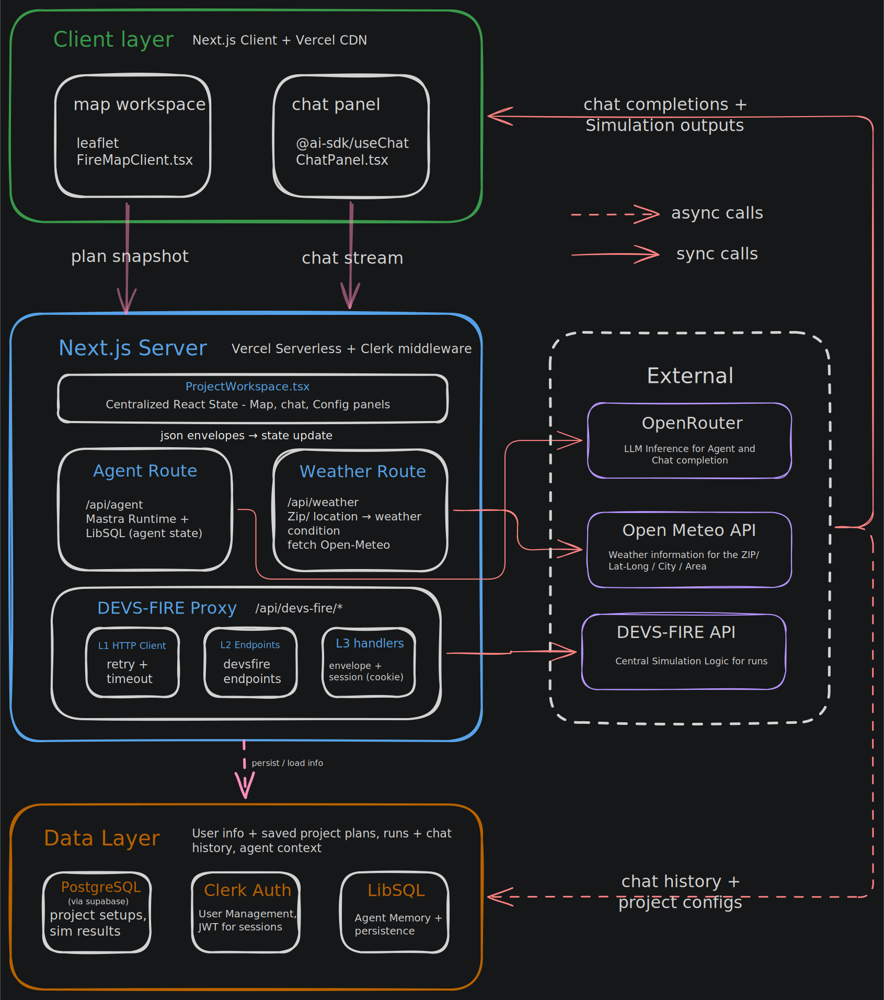

# Engineering documentation

These pages describe how **FireMapSim** is built and how to work on each major subsystem. They live in the repository so they stay next to the code and are easy to keep accurate.

**End-user guides** (getting started, workflows, troubleshooting) are in [`content/`](../content/) and are served in the running app at **`/docs`** (Nextra).

## System overview

FireMapSim is a Next.js application: an interactive map workspace, a Mastra-powered setup agent (tools + streaming chat), persistence in Supabase, authentication with Clerk, weather from Open-Meteo (and related APIs), and wildfire simulation via a **server-side** DEVS-FIRE HTTP integration (never call DEVS-FIRE directly from the browser).

## Documentation by area

| Document | What it covers |
|----------|----------------|
| [nextjs.md](./nextjs.md) | App Router, config, dev/build scripts, proxy/middleware, deployment |
| [mastra.md](./mastra.md) | Agents, tools, OpenRouter model, workflows, Mastra dev server |
| [supabase.md](./supabase.md) | Database client, migrations, project and chat persistence |
| [auth-clerk.md](./auth-clerk.md) | Clerk middleware, protected routes, auth in API handlers |
| [maps-and-geospatial.md](./maps-and-geospatial.md) | Leaflet, tiles, Konva overlays, core map components |
| [weather.md](./weather.md) | Open-Meteo and weather API routes, Mastra weather tool |
| [devs-fire.md](./devs-fire.md) | HTTP client, endpoints, Next API routes, session, connectivity |
| [testing.md](./testing.md) | Test layout under `__tests__/`, guards, commands |
| [nextra.md](./nextra.md) | Maintaining the in-app `/docs` site (content, nav, search) |

Optional historical note: if present, incident-style logs may live under [`archive/`](./archive/).
