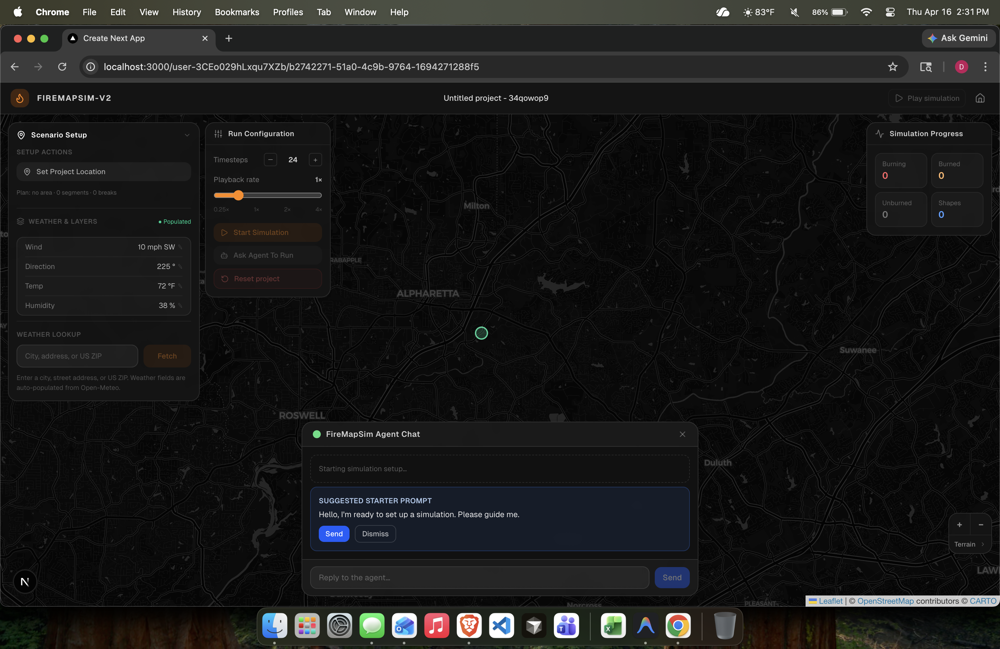

# Mastra

The AI layer uses **[Mastra](https://mastra.ai/)** for agents and workflows, **OpenRouter** for the LLM, and the **Vercel AI SDK** on the client for streaming chat to Next.js.

## Entry point

- **`src/mastra/index.ts`** — `getMastra()` builds a singleton `Mastra` instance with agents and workflows. The **`mastra`** export is a lazy proxy expected by the Mastra CLI and deployer.

## Fire simulation agent

- **`src/mastra/agents/firesim-agent.ts`** — `createFireSimAgent()` returns an `Agent` with:
  - **Model** from `getFireSimModel()` ([`src/mastra/llm/openrouter.ts`](../src/mastra/llm/openrouter.ts)): OpenRouter base URL and `openrouter/qwen/qwen3.5-397b-a17b` (requires `OPENROUTER_API_KEY`).
  - **Instructions** that distinguish **manual** vs **chat** workflow modes and require using **tools** for plan updates (no legacy fenced `setup-update` blocks).
  - **Tools**: `update-plan`, `run-simulation`, `playback-control`, `reset-project`, `geo-geocode-address`, `weather-fetch-weather`, etc., defined under `src/mastra/tools/`.

Each chat turn receives a **`RUNTIME_CONTEXT`** system message (mode + `planSnapshot`) from [`src/app/api/agent/route.ts`](../src/app/api/agent/route.ts) so the agent stays aligned with the UI plan.

## Workflows

- **`src/mastra/workflows/simulate.ts`** — registered on the Mastra instance for orchestrated flows as needed.

## Mastra dev server

`bun dev` starts Mastra alongside Next ([`scripts/dev.mjs`](../scripts/dev.mjs)):

- Mastra Studio / API: **`http://localhost:4111`** (see script log lines).

## Storage and `DATABASE_URL`

Mastra deploy and tooling may require **`DATABASE_URL`** (PostgreSQL, e.g. Supabase pooler) in production. Local development may use a file-based fallback depending on Mastra configuration; production should use a real Postgres URL. See environment notes in [`.env.example`](../.env.example) and any Mastra deploy docs you use for this repo.

## Client integration (brief)

The project workspace hosts chat via **`useChat`** and `DefaultChatTransport` pointing at **`/api/agent`**, with body fields for `mode` and `planSnapshot` ([`src/components/map/ProjectAgentChatHost.tsx`](../src/components/map/ProjectAgentChatHost.tsx)). Persisted messages are stored with the project in Supabase (see [supabase.md](./supabase.md)).

## Diagram

## Related docs

- [nextjs.md](./nextjs.md) — `/api/agent` and dev scripts.
- [weather.md](./weather.md) — `weather-fetch-weather` tool.
- [devs-fire.md](./devs-fire.md) — Mastra tools under `src/mastra/tools/devsFire/` that call Next API proxies.
